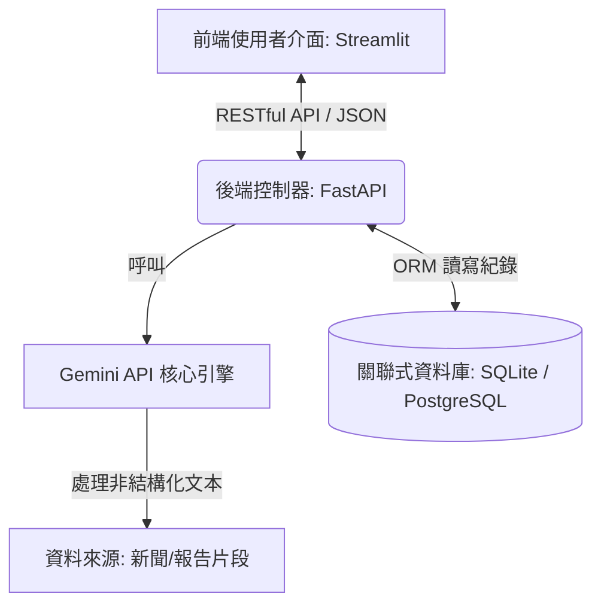

# 系統設計文件 (Design Document)

## 1. 系統架構圖

---

## 2. 核心公式

$$
Final\_Risk\_Score
=
\alpha \cdot Exposure
+
\beta \cdot (1 - Management)
$$

其中：

- $\alpha = 0.6$
- $\beta = 0.4$

---

## 3. 資料庫 Schema (Relational Model)

### Companies
- ID
- Name
- Industry
- Sector

### ESG_Reports
- ReportID
- CompanyID
- RawText
- UploadDate

### Risk_Scores
- ScoreID
- CompanyID
- ExposureScore
- ManagementScore
- FinalScore
- Timestamp
- Reasoning

---

## 4. 技術堆疊

* **語言**：Python 3.10+
* **AI 引擎**：Google Gemini API (gemini-3.5-flash)
* **前端框架**：Streamlit（互動式儀表板）
* **後端框架**：FastAPI（RESTful API 伺服器）
* **資料庫與 ORM**：SQLite（開發期）/ PostgreSQL（部署期）+ SQLAlchemy

