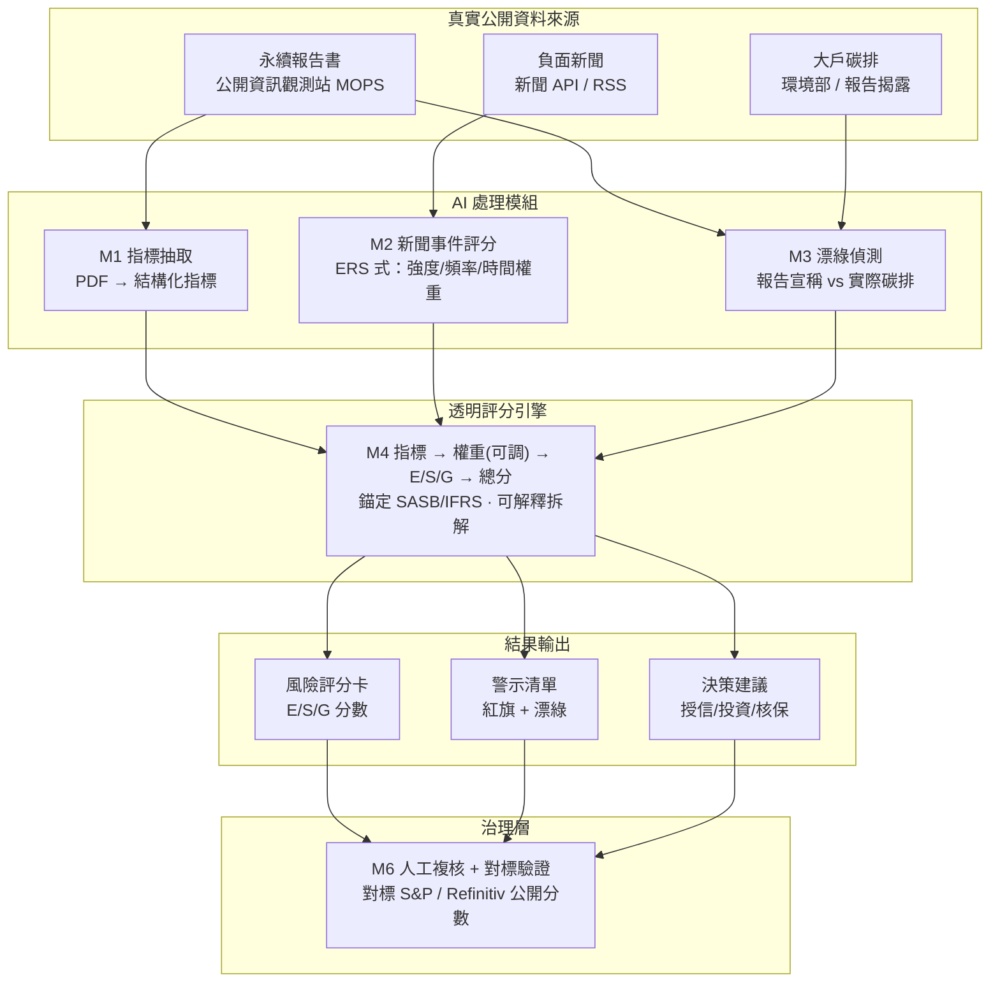

# 金融業 ESG 風險評分系統 — 系統與架構設計文件

> 本文件用途：交給 AI coding agent，依此實作各模組並串接成完整系統。
> 專案性質：大學期末專案，以 vibe coding 實作、最終需 demo。
> 評分重點：**只看結果（能跑、畫面清楚）**，不要求學術級嚴謹度或實證驗證。

---

## 1. 專案概述

**一句話**：給金融業（銀行、證券、保險）在授信、投資、核保時，快速判斷一家企業客戶或投資標的的 ESG 風險，並產出一個**透明、可解釋**的 ESG 風險分數。

**市場痛點**：金融業在做授信/投資/核保決策時，很難快速判斷對象是否有 ESG 風險（高碳排產業？有沒有負面新聞？有沒有漂綠疑慮？）。

**使用情境**：銀行要審核一筆企業貸款 → 系統分析這家公司是否屬高碳排產業、有沒有負面新聞或漂綠疑慮 → 產出 ESG 風險分數與紅旗清單，給審核人員參考。

---

## 2. 設計前提與關鍵決策（實作時請遵守）

這些是先前討論定下的方向，會影響實作取捨，agent 請務必照辦：

1. **資料以「真實公開資料」為主。** 本系統是「真實資料原生」的：永續報告書、新聞、碳排、公開分數都拿得到。盡量餵真實資料，不要全用假資料。

2. **「沒有世界標準的 ESG 分數」是常態，不是缺陷。** 國際主要評級機構（MSCI、Sustainalytics、S&P Global…）彼此分數相關性只有約 0.5，方法各異。因此本系統**不追求「正確分數」**，而是做一個**透明、有公開框架根據、可解釋**的評分——這正是歐盟新 ESG 評級法規（2026/7 上路）對真實業者的要求方向。

3. **評分必須可解釋。** 每個分數都要能點開看到「是哪些指標、用什麼權重、資料來源在報告哪一頁」推出來的。這是本系統的核心賣點，也是 demo 時的說服力來源。

4. **方法學錨定公開框架**（避免被質疑時無法自圓其說）：
   - 指標依據 **GRI / SASB**。
   - 結構與分級可模仿台灣本地、方法公開的評級：
     - **TESG 永續發展指標**（TEJ）：SASB 授權、純量化、三大支柱、A+~C- 七級，並有「ERS 事件雷達分數」——每日追蹤負面新聞、計入事件強度/新穎性/頻率/時間權重。**我們的新聞模組就模仿 ERS。**
     - **永續金融評鑑**（金管會）：專評金融業，E/S/G 各佔 25% 再加創新面向。**權重設計可參考它。**
     - **台灣永續評鑑**（台灣指數公司）：SEED 四構面、依百分位給 AAA~D。**分級方式可參考它。**

5. **Demo 穩定性優先。** ③ 的唯一真風險是模組多、現場容易爆。策略：**所有外部資料（報告 PDF、新聞）在 demo 前離線跑好、結果存成快取（JSON/SQLite），demo 當天讀快取**，不要依賴現場即時抓取的脆弱 pipeline。

6. **「指標抽取」本質是結構化資訊抽取，不是問答型 RAG。** 不要硬套向量 RAG。重點在：固定的目標指標 schema + 乾淨的 PDF/表格解析 + 強制結構化輸出。向量檢索只是「定位」的可選手段。

---

## 3. 系統架構



**四層 + 治理層的資料流**：
真實公開資料 →（AI 模組把非結構化資料變成結構化訊號）→ 透明評分引擎（算出可解釋的分數）→ 結果輸出（評分卡/警示/建議）→ 治理層（人工複核 + 對標公開分數驗證）。

---

## 4. 資料來源（真實、公開）

| 資料 | 來源 | 用途 | 備註 |
|---|---|---|---|
| 永續報告書 PDF | 公開資訊觀測站（MOPS） | M1 抽取量化指標 | 多為設計過的版面，表格解析建議走視覺 LLM |
| 負面新聞 | 新聞 API（如 NewsAPI/GNews）或 RSS | M2 事件評分 | 以中文為主；demo 前抓好快取 |
| 企業碳排揭露 | 報告書內揭露 + 環境部（大戶） | M3 漂綠比對、E 構面 | 用來和「報告宣稱」對照 |
| 公開 ESG 分數 | S&P Global / Refinitiv 免費分數 | M6 對標驗證（sanity check） | 不是評分輸入，只當驗證基準 |

---

## 5. 模組規格

### M1 — 報告指標抽取模組 ★最關鍵，先做
- **職責**：把一份永續報告書 PDF 變成一組結構化的量化指標 JSON。
- **輸入**：報告書 PDF（或預先 render 的頁面圖）。
- **輸出**：`list[Indicator]`（見第 7 節 schema），每筆含值、單位、年度、來源頁碼、信心。
- **流程**：
  1. 先載入「目標指標 schema」（固定清單，見第 7 節）。
  2. PDF → 文字 + 表格：版面單純用 `pdfplumber`/`PyMuPDF`（表格 `camelot`/`tabula`）；**永續報告書建議把頁面 render 成圖丟給視覺 LLM 讀表**（版面複雜，傳統表格抽取易爛）；整本掃描檔走 OCR（`tesseract`）。
  3. 定位：優先解析報告書末的「**GRI 內容索引 / SASB 對照表**」（直接給頁碼，等於現成檢索表）；資料太大或要擴展到多家公司時，才用向量檢索（chunk → embedding → top-k）。
  4. 結構化抽取：用 **JSON schema / function calling / Pydantic 強制結構化輸出**，每指標帶來源頁。**禁止**讓模型輸出自由文字再 regex 解析。
  5. 驗證/正規化：單位換算（公噸 CO2e、度、立方公尺）、合理範圍檢查、區分本年度 vs 去年度、缺漏標記低信心。
- **抽取核心（示意）**：
  ```python
  from pydantic import BaseModel

  class Indicator(BaseModel):
      key: str            # schema 內的指標代號，例：ghg_scope1
      name: str           # 例：範疇一溫室氣體排放
      value: float | None
      unit: str           # 例：公噸CO2e
      year: int
      source_page: int    # 留著做可解釋
      confidence: float    # 0~1

  result = llm.extract(
      schema=list[Indicator],
      context=relevant_pages,   # GRI 索引跳頁 or 向量檢索結果
      instruction="只從提供內容擷取下列指標，找不到填 null，不要臆測"
  )
  ```

### M2 — 新聞事件評分模組（模仿 TESG 的 ERS）
- **職責**：蒐集目標公司的負面新聞，分類事件、算出「事件風險分數」，產出紅旗。
- **輸入**：公司名稱/股票代號。
- **輸出**：事件清單（標題、日期、類別、嚴重度）+ 彙總後的事件分數（可餵進 S/G 構面或當獨立警示）。
- **評分邏輯（仿 ERS）**：事件分數 = f(強度, 新穎性, 頻率, 時間權重)。
  - 強度：用 LLM 分類事件嚴重程度（如：工安死亡、裁罰、訴訟、詐欺、污染…）。
  - 時間權重：越近期權重越高（指數衰減）。
- **備註**：中文新聞可搭配斷詞（`ckip`/`jieba`）；demo 前抓好快取。

### M3 — 漂綠偵測模組
- **職責**：比對「報告書宣稱」與「實際碳排/數據」，找矛盾。
- **輸入**：M1 抽出的指標 + 報告中的宣稱文字（如「致力減碳」「淨零承諾」）。
- **輸出**：漂綠旗標清單（宣稱 vs 實際數據的落差說明）。
- **邏輯**：用 LLM 擷取報告中的承諾/正面宣稱 → 對照實際數據趨勢（碳排有沒有真的降、是否有第三方確信）→ 標記矛盾。

### M4 — 透明評分引擎 ★核心賣點
- **職責**：把所有結構化訊號（M1/M2/M3）依**可調權重**算成 E/S/G 子分與總分，並保留可解釋拆解。
- **輸入**：指標 + 事件分數 + 漂綠旗標。
- **輸出**：E 分、S 分、G 分、總分、分級、以及「每個分數由哪些指標×權重組成」的拆解。
- **設計要點**：
  - 純 Python、**確定性**（同輸入同輸出）。
  - 權重放在外部設定檔（YAML/JSON），可調、可展示（呼應歐盟「揭露 E/S/G 權重」原則）。
  - 指標先正規化（缺漏、產業基準）→ 加權 → 子分 → 總分。
  - 分級方式二選一（見第 8 節）：百分位（仿台灣永續評鑑 AAA~D）或固定門檻（仿 TESG A+~C-）。
  - **每個分數可回溯到指標與來源頁**。

### M5 — 結果輸出 / 前端
- **職責**：把評分結果視覺化呈現（這就是課程要看的「結果」）。
- **畫面**：
  - 風險評分卡：總分 + 分級 + E/S/G 雷達圖/長條圖。
  - 可解釋拆解：點分數展開看貢獻指標與來源頁。
  - 警示清單：紅旗（負面事件）+ 漂綠警示。
  - 決策建議：依分數給「授信/投資/核保」參考燈號（高/中/低風險）。

### M6 — 治理層（人工複核 + 對標驗證）
- **職責**：審核人員可調整/確認；系統把自己的分數對標公開分數做 sanity check。
- **對標驗證**：把本系統分數和 S&P Global/Refinitiv 免費分數算相關性，展示「我的分數和公開分數相關 X，分歧處原因是……」——這是很成熟的評估故事（即使無法用 ground truth 驗證）。

---

## 6. 端到端業務流程

1. 審核人員輸入「目標公司」（名稱/代號）。
2. 系統載入該公司快取資料（報告指標、新聞、碳排）。
3. M1/M2/M3 產出結構化訊號。
4. M4 算出 E/S/G 與總分（含可解釋拆解）。
5. M5 呈現評分卡 + 警示 + 決策建議。
6. M6 人工複核，並對標公開分數驗證。

---

## 7. 目標指標 schema（起始版，可增刪）

> 這份清單同時是「方法學依據」。每個指標標註對應 GRI/SASB，抽取與評分都對著它做。

| 構面 | key | 指標 | 單位 | 對應框架 |
|---|---|---|---|---|
| E | ghg_scope1 | 範疇一溫室氣體排放 | 公噸CO2e | GRI 305-1 |
| E | ghg_scope2 | 範疇二溫室氣體排放 | 公噸CO2e | GRI 305-2 |
| E | ghg_scope3 | 範疇三溫室氣體排放 | 公噸CO2e | GRI 305-3 |
| E | carbon_intensity | 每百萬營收碳排（碳強度） | 公噸CO2e/百萬元 | SASB |
| E | electricity | 用電量 | 度(kWh) | GRI 302-1 |
| E | renewable_ratio | 再生能源占比 | % | GRI 302 |
| E | water | 用水量 | 立方公尺 | GRI 303-5 |
| E | waste | 廢棄物總量 | 公噸 | GRI 306 |
| S | injury_rate | 失能傷害頻率/職災率 | 比率 | GRI 403 |
| S | turnover | 員工流動率 | % | GRI 401 |
| S | female_ratio | 女性員工比例 | % | GRI 405-1 |
| S | female_mgmt_ratio | 女性主管比例 | % | GRI 405-1 |
| S | training_hours | 員工平均訓練時數 | 小時 | GRI 404-1 |
| G | independent_director_ratio | 獨立董事比例 | % | GRI 2-9 |
| G | female_director_ratio | 女性董事比例 | % | GRI 405-1 |
| G | has_sustainability_officer | 是否設永續長/委員會 | 布林 | — |
| G | assurance | 報告是否取得第三方確信 | 布林 | — |
| G | violations | 重大違規/裁罰次數 | 次 | GRI 2-27 |
| 事件 | news_event_score | 負面事件風險分數（M2） | 0~1 | 仿 ERS |
| 事件 | greenwash_flag | 漂綠矛盾旗標（M3） | 布林/清單 | — |

---

## 8. 評分方法學

1. **正規化**：每個指標相對「產業基準」或「樣本公司分布」標準化到 0~1（碳排類越低越好、女性主管比例越高越好，注意方向）。
2. **加權**：權重放外部設定檔。預設可採其一：
   - E/S/G 各 1/3；或
   - 仿永續金融評鑑：E/S/G 各 25% + 其他/創新 25%。
3. **子分 → 總分**：各構面內指標加權平均 → 構面分 → 構面加權 → 總分。
4. **事件調整**：M2 的負面事件分數、M3 的漂綠旗標可對總分做扣分（仿 ERS 把事件反映在等級上）。
5. **分級**（二選一）：
   - 百分位法（仿台灣永續評鑑）：AAA=前 5%、AA=5~15%…
   - 固定門檻法（仿 TESG）：A+/A/B+/B/B-/C/C-。
6. **可解釋**：輸出時保留每個分數的指標貢獻與來源頁。

---

## 9. 建議技術選型（可調整）

- 後端 / 語言：Python 3.11+、FastAPI
- PDF 解析：`pdfplumber` / `PyMuPDF`（表格 `camelot`/`tabula`）、掃描檔 `tesseract` OCR、複雜版面用視覺 LLM
- LLM 抽取：以 tool use / function calling + `pydantic` 做結構化輸出
- 向量檢索（選用，擴展時才上）：embedding 用 `BGE-m3` 或 `multilingual-e5`；向量庫 `Chroma` / `FAISS` / `LanceDB`
- 新聞：新聞 API 或 RSS，中文斷詞 `ckip` / `jieba`（視需要）
- 評分引擎：純 Python + 權重設定檔（YAML/JSON）
- 儲存 / 快取：SQLite 或 JSON 檔（demo 足夠）
- 前端：React + Recharts / Chart.js（雷達圖、長條圖、警示清單）

---

## 10. 實作順序（給 agent 的 build plan）

- **Phase 0｜資料與設定**：挑 3~5 家目標公司、抓報告 PDF 與新聞、定 schema 與權重設定檔。
- **Phase 1｜M1 報告抽取**：PDF → 結構化指標 JSON（最關鍵，先做穩）。
- **Phase 2｜M4 評分引擎**：用 M1 輸出算 E/S/G 與總分。**做到這裡「報告 → 評分卡」整條能動 = 最小可 demo（MVP）。**
- **Phase 3｜M2 新聞 + M3 漂綠**：加上事件分數與漂綠警示。
- **Phase 4｜M5 前端**：評分卡 / 警示 / 決策建議的視覺化。
- **Phase 5｜M6 治理**：人工複核 UI + 對標公開分數驗證。
- 每個 phase 都先離線跑、把結果存快取。

---

## 11. 待你確認的開放決策

以下是先前對話中**尚未明確定案**的部分（不是我忘記，是還沒決定），開工前最好先拍板：

1. **你的技術底**：影響要不要上向量 RAG、前端做多複雜。先前未明確回答，目前預設為「中等、主要靠 vibe coding」。
2. **demo 目標公司**：幾家、哪幾家？建議挑 1 家「乾淨」+ 1 家「有負面新聞/高碳排」做對比，效果最好。
3. **E/S/G 權重的具體數字**：用各 1/3，還是仿永續金融評鑑各 25% + 創新？
4. **新聞來源與語言**：以中文為主？用哪個新聞 API？
5. **分級方式**：百分位（AAA~D）還是固定門檻（A+~C-）？
6. **LLM 供應商**：用哪一家做抽取與分類？
